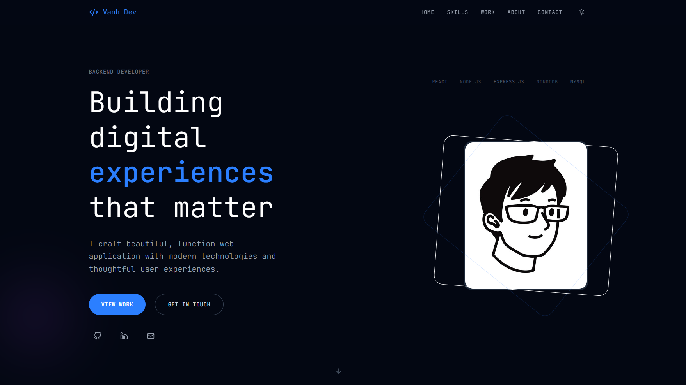
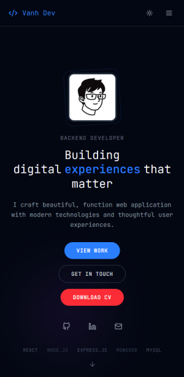

# 🚀 Nguyen Van Anh | Portfolio Website

A modern, responsive personal portfolio website built with React and Vite, showcasing my skills, projects, and professional journey as a developer.

## 📸 Screenshots

### Desktop View



### Mobile View



## ✨ Features

- **🎨 Modern Design**: Clean, professional UI with smooth animations
- **🌙 Dark Theme**: Sleek dark theme optimized for developer aesthetics
- **📱 Responsive**: Fully responsive design that works on all devices
- **⚡ Fast Performance**: Built with Vite for lightning-fast development and build times
- **🎭 Smooth Animations**: Powered by Framer Motion for engaging user interactions
- **📧 Contact Form**: Integrated email functionality using EmailJS
- **🎯 Interactive Sections**: Hero, Skills, Projects, About, and Contact sections

## 🛠️ Tech Stack

### Frontend

- **React 19** - Latest version of React with modern features
- **Vite** - Next-generation frontend tooling
- **Tailwind CSS 4** - Utility-first CSS framework for styling
- **Framer Motion** - Production-ready motion library for React

### Additional Libraries

- **Lucide React** - Beautiful & consistent icon pack
- **React Icons** - Popular icon libraries for React
- **EmailJS** - Send emails directly from frontend

### Development Tools

- **ESLint** - Code linting with React-specific rules
- **PostCSS** - CSS processing

## 🚀 Quick Start

### Prerequisites

- Node.js (v18 or higher)
- npm or yarn

### Installation

1. **Clone the repository**

   ```bash
   https://github.com/VanAnhstudents/personal-portfolio-website.git
   cd personal-portfolio-website
   ```

2. **Install dependencies**

   ```bash
   npm install
   # or
   yarn install
   ```

3. **Start the development server**

   ```bash
   npm run dev
   # or
   yarn dev
   ```

4. **Open your browser**
   Navigate to `http://localhost:5173` to see the website in action!

## 📦 Build & Deployment

### Build for production

```bash
npm run build
# or
yarn build
```

### Preview production build

```bash
npm run preview
# or
yarn preview
```

### Deploy

The built files will be in the `dist` folder, ready to be deployed to any static hosting service like:

- Vercel
- Netlify
- GitHub Pages
- Firebase Hosting

## 📁 Project Structure

```
src/
├── components/
│   ├── Navbar.jsx           # Navigation component
│   ├── Footer.jsx           # Footer component
│   └── Sections/
│       ├── HeroSection.jsx      # Landing/Hero section
│       ├── SkillsSection.jsx    # Skills showcase
│       ├── ProjectsSection.jsx  # Projects portfolio
│       ├── AboutSection.jsx     # About me section
│       └── ContactSection.jsx   # Contact form
├── context/
│   └── ThemeContext.jsx     # Theme management
├── App.jsx                  # Main app component
├── main.jsx                 # App entry point
└── index.css               # Global styles & Tailwind imports
```

## 🎨 Customization

### Fonts

The website uses **JetBrains Mono** as the primary font, perfect for a developer portfolio. You can change it in `src/index.css`:

```css
@import url("https://fonts.googleapis.com/css2?family=Your-Font:wght@400;500;600;700&display=swap");

@theme {
  --font-display: "Your Font", sans-serif;
}
```

### Colors & Theme

Customize the color scheme by modifying the Tailwind configuration and CSS variables.

### Content

Update the content in each section component to reflect your personal information, skills, and projects.

## 📧 Contact Form Setup

To enable the contact form functionality:

1. Sign up for [EmailJS](https://www.emailjs.com/)
2. Create an email service and template
3. Add your EmailJS configuration to the ContactSection component
4. Replace the placeholder keys with your actual EmailJS keys

## 🔧 Scripts

| Command           | Description              |
| ----------------- | ------------------------ |
| `npm run dev`     | Start development server |
| `npm run build`   | Build for production     |
| `npm run preview` | Preview production build |
| `npm run lint`    | Run ESLint               |

## 🌟 Performance Features

- **Tree Shaking**: Automatic removal of unused code
- **Code Splitting**: Optimized bundle splitting for faster loads
- **Image Optimization**: Optimized images for better performance
- **Modern JavaScript**: Uses latest ES features with proper fallbacks

## 🤝 Contributing

If you'd like to contribute to this project:

1. Fork the repository
2. Create your feature branch (`git checkout -b feature/AmazingFeature`)
3. Commit your changes (`git commit -m 'Add some AmazingFeature'`)
4. Push to the branch (`git push origin feature/AmazingFeature`)
5. Open a Pull Request

## 📬 Contact

**Nguyen Van Anh** - Developer

- Portfolio: [Your Website](https://vananhstudents.github.io/personal-portfolio-website/)
- Email: anhnguyenvan280105@gmail.com
- LinkedIn: [Your LinkedIn](https://www.linkedin.com/in/anh-nguyen-425307375/)
- GitHub: [Your GitHub](https://github.com/VanAnhstudents)

---

⭐ **If you found this project helpful, please give it a star!** ⭐

---

_Built with ❤️ Vanh | Dev_
